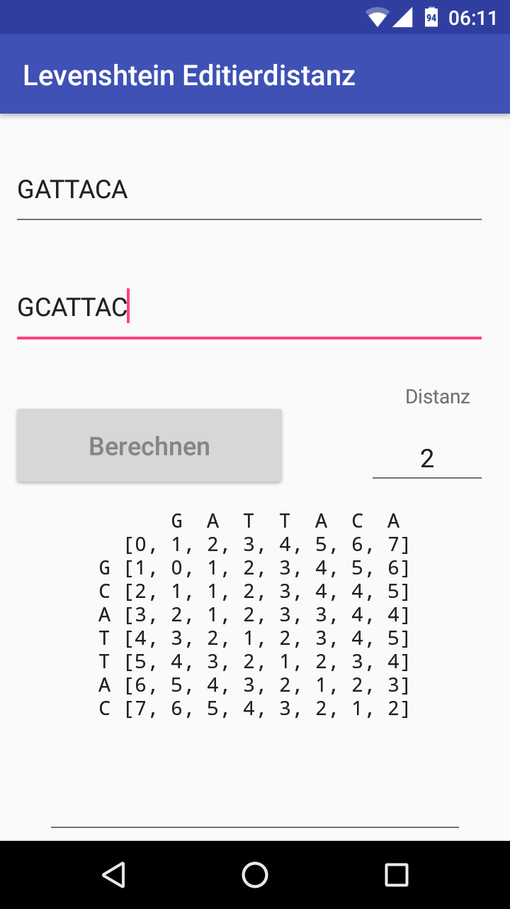

## Levenshtein's Edit Distance for Android

A basic Android app for calculating the minimum edit distance between two strings using Levenshtein's algorithm. Designed as a follow-up to the [BI002](https://github.com/glutanimate/BI002) course at my university.

### Screenshots

### Credits and License

*Levenshtein's Edit Distance for Android* is Copyright © 2017-2018 Aristotelis P.

This program is free software: you can redistribute it and/or modify it under the terms of the GNU Affero General Public License as published by the Free Software Foundation, either version 3 of the License, or (at your option) any later version.

This program is distributed in the hope that it will be useful, but WITHOUT ANY WARRANTY; without even the implied warranty of MERCHANTABILITY or FITNESS FOR A PARTICULAR PURPOSE. See the GNU General Public License for more details.